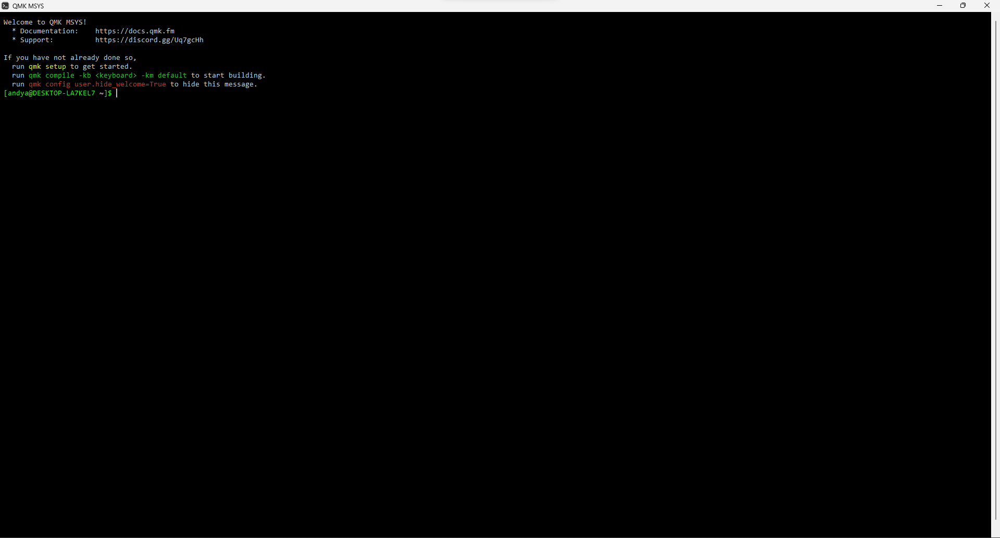
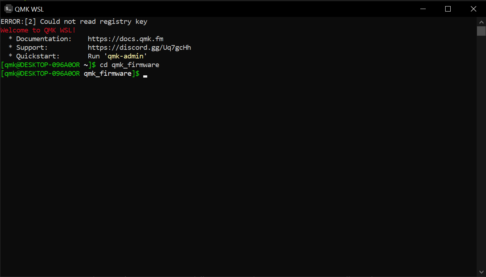

# `VIAL for Keychron` - How to compile this source

---

> :warning: : THIS CODE IS INTENDED FOR EDUCATIONAL PURPOSES ONLY AND DOES NOT REPRESENT KEYCHRON IN ANY WAY. PLEASE NOTE, ALTHOUGH THE RISK OF BRICKING YOUR Q/V BOARD IS SLIM AT BEST, FOLLOW THIS GUIDE AT YOUR OWN RISK AND ONLY IF YOU KNOW WHAT YOU ARE DOING. I AM ONLY PROVIDING THE ABILITY FOR YOU TO MAKE A COMPILED VERSION FOR YOUR BOARD FOR THE SAKE OF UNDERSTANDING HOW THIS WORKS BEFORE YOU MAKE YOUR CHANGES AND FLASH THE BOARD. 

---

Compile VIAL-QMK for the Keychron non-Pro/Max Q/V series.

## Prerequisites
* [QMK MSYS](https://msys.qmk.fm/) (If you use Windows; recommended; slow, but easy to setup)
* [QMK WSL](https://qmk.github.io/qmk_distro_wsl/) (If you use Windows; fast, but takes time to configure)
    * You will also need WSL installed to be able to use QMK WSL. If you don't have it installed, refer to the guide [`here`](https://learn.microsoft.com/en-us/windows/wsl/install). Otherwise, you'll run into this error: 
    

    
    If any other error codes popup, [`refer to MS's troubleshooting site for WSL.`](https://learn.microsoft.com/en-us/windows/wsl/troubleshooting)
* [VIAL](https://get.vial.today/)
* Text Editor (Visual Studio Code, Sublime, Notepad++; I'd recommend Visual Studio Code to make messing with your firmware easier)

## About
This code base supports the entire Keychron Q/V lineup (will update to include unreleased models) -- the STM32 MCU versions --- with one code base and VIAL sideload files for the respective boards.

This code base supports most of the entire Keychron Q/V lineup. There are instructions to compile and flash the VIAL firmware for each board, that of which is denoted in their respective `readme.md` file, usually something akin to:
    make keychron/[model]/[layout]:vial:flash

## Preparation
For the purposes of this guide, we'll be taking a Windows-centralized sense, and I'll be covering QMK MSYS and [QMK] WSL. We will be following most of the steps covered in the QMK [guide](https://docs.qmk.fm/#/newbs_getting_started), so if you want to follow along, open this page up in a seperate tab. 
## Setup
# QMK MSYS (Easy)
(Since QMK MSYS is based off of MSYS2 while also being packaged with the QMK CLI, the former also haveing Git support, we can also use git commands to update the repo as we wish.)
1. With QMK MSYS installed, and opened, you'll be greeted with this inside its terminal:

      * By default, the terminal location will be set inside the "C:\Users\[user]" path. 
         * Do ***<ins>NOT</ins>*** run `qmk setup` as the first thing you enter. This will clone the main QMK repo (`qmk_firmware`) and not the vial repo itself. (`vial-qmk`)

2. Next, in the MSYS terminal, enter `git clone --recurse-submodules https://github.com/vial-kb/vial-qmk.git` to clone the repo to where the terminal is inside. (`--recurse-submodules` will clone the necessary submodules (remote repos) that are also necessary for compiling the firmware.)
3. Enter the repo you cloned with `cd vial-qmk` and run `qmk setup` to make sure that your enviromnent is setup correctly.
   * If you, for some reason, get an option to clone submodules with `y/n`, enter `y` and it'll clone the necesssary submodules.

# QMK WSL (Intermediate)
(As mentioned before, you **<ins>will</ins>** need to have WSL (Windows Subsystem for Linux) enabled for your machine from Windows Features in order to use QMK WSL.)

1. With QMK WSL installed, there will now be a new folder that'll show up in File/Windows Explorer, something like this on the left hand side:

When you open the application, it'll bring up a terminal that already has the QMK CLI installed that's required to be able to do the commands like compiling and flashing.

   * By default, the terminal location will be set inside the "C:\Users\[user]" path.
      * Do ***<ins>NOT</ins>*** run `qmk setup` as the first thing you enter. This will clone the main QMK repo (`qmk_firmware`) and not the vial repo itself. (`vial-qmk`)

2. In the QMK WSL terminal, enter `git clone --recurse-submodules https://github.com/vial-kb/vial-qmk.git` to clone the repo to where the terminal is inside. (`--recurse-submodules` will clone the necessary submodules (remote repos) that are also necessary for compiling the firmware.)
3. Enter the repo you cloned with `cd vial-qmk` and run `qmk setup` to make sure that your enviromnent is setup correctly.
   * If you, for some reason, get an option to clone submodules with `y/n`, enter `y` and it'll clone the necesssary submodules.

# Compiling and Flashing

1. To test that everything went smoothly, you should compile the **default** keymap and flash it on your board so as to make sure that both, the keys register and that the LEDs work properly.
    * To flash the board, enter `make keychron/[model]/[variant]:default:flash` (`[model]` and `[variant]` you replace with the board and variant you have, which is self-explanatory) and put your board into bootloader mode. (To do it with Keychron boards, you press and hold the Reset button that's next to the Spacebar key to the left.) The process goes like this: 
        1. Unplug the board after entering the command.
        2. Press and hold the Reset button while plugging back in the USB-C cable. 
        3. WSL will begin erasing and flashing the new firmware you just compiled.
        4. Success?
        5. Profit
    * Once that is completed and the board is flashed, check to make sure that the keys register and that the LEDs work properly. If the two criteria is completed, you can move on to compiling the VIAL keymap and flashing the firmware.

2. Once you made the changes you want to make, assuming you want to make your own custom firmare, follow Step 1, but replace `default` with `vial` while also following sub-steps 1-5. Once that's done, again, check to make sure that keys register and that the LEDs function properly. If all goes good and well, congradulations, you've successfully flash VIAL firmware.  
## VIA
A lot has changed since then. Ever since the update to Protocol 10 for VIA from August 2022, compatability for VIAL for boards that have VIA firmware loaded has has introduced an ultimatum for the end-user. Now, it's a case of whether to stay on normal VIA firmware and only use VIA while being able to use the latest features from > 2.0.5, or to stick with VIAL firmware and only use VIAL while not having the latest features on the QMK side by dealing with not merging with Breaking Changes often. Something to keep in mind.

> From how I see it, there's no point having multiple variants of the JSON file for each keyboard variant since VIA and VIAL handle multiple layouts from 1 single JSON file. 

-- Written by Adophoxia
