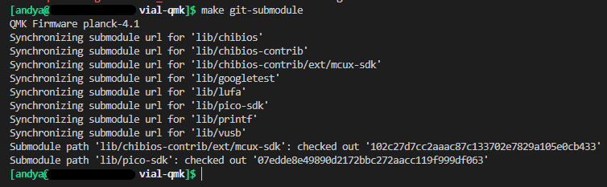

# `VIAL for Keychron` - How to compile this source

---

> :warning: : THIS CODE IS INTENDED FOR EDUCATIONAL PURPOSES ONLY AND DOES NOT REPRESENT KEYCHRON IN ANY WAY. PLEASE NOTE, ALTHOUGH THE RISK OF BRICKING YOUR Q/V BOARD IS SLIM AT BEST, FOLLOW THIS GUIDE AT YOUR OWN RISK AND ONLY IF YOU KNOW WHAT YOU ARE DOING. I AM ONLY PROVIDING THE ABILITY FOR YOU TO MAKE A COMPILED VERSION FOR YOUR BOARD FOR THE SAKE OF UNDERSTANDING HOW THIS WORKS BEFORE YOU MAKE YOUR CHANGES AND FLASH THE BOARD. 

---

Compile VIAL-QMK for the Keychron Q/V series, using @tzarc's EFL *(Embedded Flash Library)* driver and wear-leveling algorithm.

## Prerequisites
* [QMK MSYS](https://msys.qmk.fm/) (If you use Windows)
* [VIAL](https://get.vial.today/)
* Text Editor (Visual Studio Code, Sublime, Notepad++; I'd recommend Visual Studio Code to make messing with your firmware easier)

## About
This code base supports the entire Keychron Q/V lineup (will update to include unreleased models) -- the STM32 MCU versions --- with one code base and VIAL sideload files for the respective boards.  To compile the firmware, you will need to compile off the [`adophoxia/vial-qmk:vial-keychron`](https://github.com/adophoxia/vial-qmk/tree/vial-keychron) repo:branch, which includes the EFL driver, and the "wear-leveling algorithm" - added with PR's [#16996](https://github.com/qmk/qmk_firmware/pull/16996), [#17651](https://github.com/qmk/qmk_firmware/pull/17651), and [#17661](https://github.com/qmk/qmk_firmware/pull/17661), all merged from remote:upstream qmk:master. (The wear-leveling algorithm and EFL driver is needed to make the boards have emulated EEPROM, which is where the dynamic keymap used by VIA and some other variables, but persistent, settings are stored. If you ever wondered why sometimes, your keybinds don't save when you close VIA, this is just so that doesn't happen if that's the case.)

## Preparation
For the purposes of this guide, we'll be taking a Windows-centralized sense, meaning MSYS is needed. We will be following most of the steps covered in the QMK (guide)[https://docs.qmk.fm/#/newbs_getting_started], so if you want to follow along, open this page up in a seperate tab. 
## How to
1. If you haven't already create an instance of the source code on your computer - you'll want to use either a fork of, or a clone of:
    * [`adophoxia/vial-qmk:vial-keychron`](https://github.com/adophoxia/vial-qmk/tree/vial-keychron) - The `vial-keychron` branch of my fork of VIAL-QMK.  *(Works for EFL/WL compile.)
        * Using Git clone is preferred. To clone with Git, type: `git clone -b vial-keychron https://github.com/adophoxia/vial-qmk.git`

2. With QMK MSYS open, navigate to the root folder of the repo you downloaded it to. (`cd [path/to/qmk_firmware]`). Usually, it'll download to your `C:/Users/[username]` directory, but that may not be the case if you opened Git Bash inside a folder.
    * If you're using VS Code, you can make using MSYS easier by adding it as a terminal option [here](https://docs.qmk.fm/#/other_vscode?id=configuring-vs-code), so that when you open the terminal and pick MSYS, it'll automatically go to root and you can use the commands right away.

3. Run `qmk setup` to make sure that your enviromnent is setup correctly.
    * If you get an option to clone submodules with `y/n`, enter `n` for now and type `make git-submodule`after that. This is required to make compiling your firmware be as smooth as possible. You should get this once the process is done with no errors.

4. That should be it. No really. You're ready to compile. To test that everything went smoothly, you should compile the **default** keymap and flash it on your board so as to make sure that both, the keys register and that the LEDs work properly. 
    * To compile the default keymap, with MSYS in the root of the `qmk_firmware` folder, enter `make keychron/[keyboard]/[keyboard_variant]:default` ("keyboard" and "keyboard_variant", you replace with what board you have.)
    * To flash the board, enter `make keychron/[keyboard]/[keyboard_variant]:default:flash` and put your board into bootloader mode. (To do it with Keychron boards, you press and hold the reset button that's underneath the spacebar key. The process goes like this: 
        1. Unplug the board after entering the command.
        2. Press and hold the reset while plugging back in the USB-C cable. 
        3. MSYS will begin erasing and flashing the new firmware you just compiled
        4. Success?
        5. Profit
    Once that is completed, check to make sure that the keys register and that the LEDs work properly. If the two criteria is completed, you can move on to compiling the VIAL keymap and flashing the firmware.

5. Once you made the changes you want to make, follow step 4, but replace `default` with `vial` while also following sub-steps a-e. Once that's done, again, check to make sure that keys register and that the LEDs function properly. If all goes good and well, congradulations, you've successfully flash VIAL firmware.  
## The V series
From word of mouth, the V series uses the same PCB as the Q series, meaning theoretically, you could make 1 firmware base that encompasses knob support, cross-platform compatability between the Q/V boards and the 3 layouts (ANSI/ISO/JIS). How much of that is true for me to make a single firmware, I'm not sure, which is why currently, I won't be including an entry for it for the time being. 
## VIA
Since the `vial.json` used is flashed onto the keyboard firmware, VIA will automatically detect your Q/V board, meaning gone are the days where you have to load the JSON every time you open VIA, if you still choose to use it.

> From how I see it, there's no point having multiple variants of the JSON file for each keyboard variant since VIA and VIAL handle multiple layouts from 1 single JSON file. 

-- Written by Adophoxia
