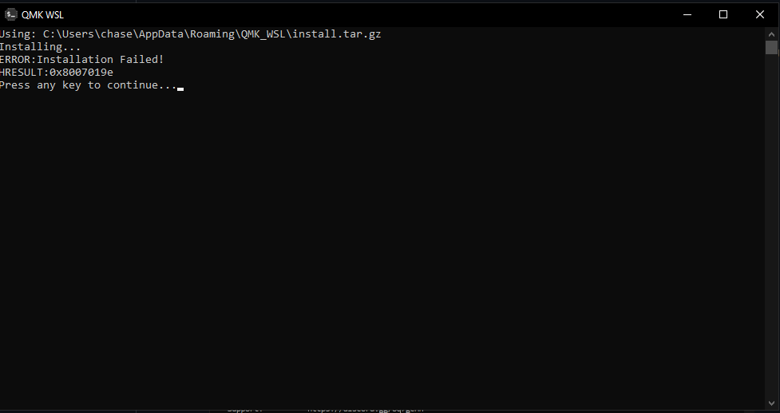
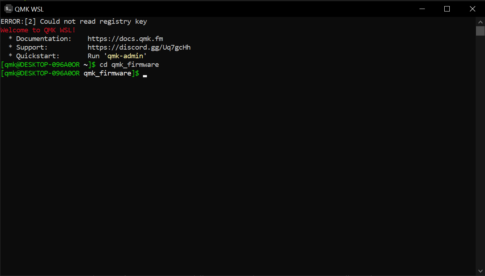

# `VIAL for Keychron` - How to compile this source

---

> :warning: : THIS CODE IS INTENDED FOR EDUCATIONAL PURPOSES ONLY AND DOES NOT REPRESENT KEYCHRON IN ANY WAY. PLEASE NOTE, ALTHOUGH THE RISK OF BRICKING YOUR Q/V BOARD IS SLIM AT BEST, FOLLOW THIS GUIDE AT YOUR OWN RISK AND ONLY IF YOU KNOW WHAT YOU ARE DOING. I AM ONLY PROVIDING THE ABILITY FOR YOU TO MAKE A COMPILED VERSION FOR YOUR BOARD FOR THE SAKE OF UNDERSTANDING HOW THIS WORKS BEFORE YOU MAKE YOUR CHANGES AND FLASH THE BOARD. 

---

Compile VIAL-QMK for the Keychron Q/V series, using @tzarc's EFL *(Embedded Flash Library)* driver and wear-leveling algorithm.

## Prerequisites
* [QMK MSYS](https://msys.qmk.fm/) (If you use Windows)
* [QMK WSL](https://qmk.github.io/qmk_distro_wsl/) (If you use Windows; recommended)
    * You will also need WSL installed to be able to use QMK WSL. If you don't have it installed, refer to the guide [`here`](https://learn.microsoft.com/en-us/windows/wsl/install). Otherwise, you'll run into this error: 
    

    
    If any other error codes popup, [`refer to MS's troubleshooting site for WSL.`](https://learn.microsoft.com/en-us/windows/wsl/troubleshooting)
* [VIAL](https://get.vial.today/)
* Text Editor (Visual Studio Code, Sublime, Notepad++; I'd recommend Visual Studio Code to make messing with your firmware easier)

## About
This code base supports the entire Keychron Q/V lineup (will update to include unreleased models) -- the STM32 MCU versions --- with one code base and VIAL sideload files for the respective boards.

This code base supports most of the entire Keychron Q/V lineup (more board to come after they get merged into [`qmk:master`](https://github.com/qmk/qmk_firmware/tree/master/keyboards/keychron/); the Q1v1 (ATmega32u4) is still not in upstream QMK, so that's in a TBD state.) --  the STM32 MCU versions --- with one code base and VIAL sideload files for the respective boards. There are instructions to compile and flash the VIAL firmware for each board, that of which is denoted in their respective `readme.md` file, usually something akin to:
    make keychron/[model]/[layout]:vial:flash

## Preparation
For the purposes of this guide, we'll be taking a Windows-centralized sense, and this time, we'll be utilizing QMK WSL which gives us faster compile times so that we can have our firmware quicker. We will be following most of the steps covered in the QMK [guide](https://docs.qmk.fm/#/newbs_getting_started), so if you want to follow along, open this page up in a seperate tab. 
## How to
1. With QMK WSL installed, there will now be a new folder that'll show up in File/Windows Explorer, something like this:

When you open the application, it'll bring up a terminal that already has the QMK CLI installed that's required to be able to do the commands like compiling and flashing.

By default, the terminal will be inside the `qmk` folder inside `\\wsl.localhost\QMK\home\qmk`. To clone the vial repo, you'll need to type in `git clone --recurse-submodules https://github.com/vial-kb/vial-qmk.git`. `--recurse-submodules` will clone the necessary submodules (remote repos) that are also necessary for compiling the firmware. After the repo is cloned assuming that things go wellm you can now enter the folder for the repo via `cd vial-qmk`

2. Run `qmk setup` to make sure that your enviromnent is setup correctly.
    * If you get an option to clone submodules with `y/n`, enter `y` and it'll clone the necesssary submodules.

3. That should be it. No really. You're ready to compile. To test that everything went smoothly, you should compile the **default** keymap and flash it on your board so as to make sure that both, the keys register and that the LEDs work properly. 
    * To flash the board, enter `make keychron/[model]/[layout]:default:flash` and put your board into bootloader mode. (To do it with Keychron boards, you press and hold the reset button that's underneath the spacebar key.) The process goes like this: 
        1. Unplug the board after entering the command.
        2. Press and hold the reset button while plugging back in the USB-C cable. 
        3. WSL will begin erasing and flashing the new firmware you just compiled
        4. Success?
        5. Profit
    Once that is completed, check to make sure that the keys register and that the LEDs work properly. If the two criteria is completed, you can move on to compiling the VIAL keymap and flashing the firmware.

5. Once you made the changes you want to make, follow step 4, but replace `default` with `vial` while also following sub-steps a-e. Once that's done, again, check to make sure that keys register and that the LEDs function properly. If all goes good and well, congradulations, you've successfully flash VIAL firmware.  
## The V series
From word of mouth, the V series uses the same PCB as the Q series, meaning theoretically, you could make 1 firmware base that encompasses knob support, cross-platform compatability between the Q/V boards and the 3 layouts (ANSI/ISO/JIS). How much of that is true for me to make a single firmware, I'm not sure, which is why currently, I won't be including an entry for it for the time being. 
## VIA
A lot has changed since then. Ever since the update to Protocol 10 for VIA from August 2022, compatability for VIA for boards that have VIAL firmware loaded has made them obsolete to use both, so it's now a case of whether to stay on normal VIA firmware and only use VIA, or stick with VIAL firmware and only use VIAL. Something to keep in mind.

> From how I see it, there's no point having multiple variants of the JSON file for each keyboard variant since VIA and VIAL handle multiple layouts from 1 single JSON file. 

-- Written by Adophoxia
