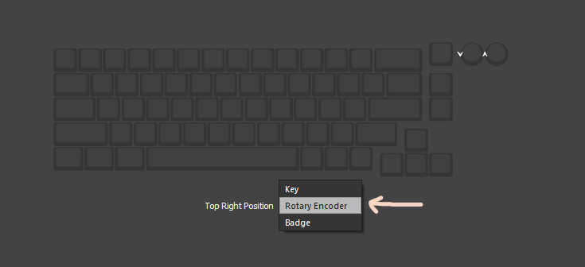

# `VIAL Keychron` - How to compile this source

---

> :warning: : THIS CODE IS INTENDED FOR EDUCATIONAL PURPOSES ONLY AND DOES NOT REPRESENT KEYCHRON IN ANY WAY.

---

Compile VIAL-QMK for the Keychron Q/V series, using @tzarc's EFL *(Embedded Flash Library)* driver and wear-leveling algorithm.

## Prerequisites
* [QMK MSYS](https://msys.qmk.fm/) (If you use Windows)
* [VIAL](https://get.vial.today/)
* Text Editor (Visual Studio Code, Sublime, Notepad++; I'd recommend Visual Studio Code to make messing with your firmware easier)

## About
This code base supports the entire Keychron Q/V lineup (will update to include unreleased models) -- the STM32 MCU versions --- with one code base and VIAL sideload files for the respective boards.  To compile the firmware, you will need to compile off the [`adophoxia/vial-qmk:vial_keychron-only`](https://github.com/adophoxia/vial-qmk/tree/vial-keychron_only) repo:branch, which includes the EFL driver, and the "wear-leveling algorithm" - added with PR's [#16996](https://github.com/qmk/qmk_firmware/pull/16996), [#17651](https://github.com/qmk/qmk_firmware/pull/17651), and [#17661](https://github.com/qmk/qmk_firmware/pull/17661), all merged from remote:upstream qmk:master. (The wear-leveling algorithm and EFL driver is needed to make the boards have emulated EEPROM, which is where the dynamic keymap used by VIA and some other variables, but persistent, settings are stored. If you ever wondered why sometimes, your keybinds don't save when you close VIA, this is just so that doesn't happen if that's the case.)

## Preparation
For the purposes of this guide, we'll be taking a Windows-centralized sense, meaning MSYS is needed.
1. If you haven't already create an instance of the source code on your computer - you'll want to use either a fork of, or a clone of:
    * [`adophoxia/vial-qmk:vial_keychron_only`](https://github.com/adophoxia/vial-qmk/tree/vial-keychron-only) - The `vial_keychron_only` branch of my fork of VIAL-QMK.  *(Works for EFL/WL compile.)
        * Using Git clone is preferred. To clone with Git, type:
            ```git clone -b vial_keychron_only https://github.com/adophoxia/vial-qmk.git```

2. Navigate to the root of the repo's folder.
    * If you're using VS Code, you can make using MSYS easier by adding it as a terminal option [here](https://docs.qmk.fm/#/other_vscode?id=configuring-vs-code), so that when you open the terminal and pick MSYS, it'll automatically go to root and you can use the commands right away.

3. Run `make git-submodule` to clone the git submodules. This is required to make compiling your firmware be as smooth as possible. 

4. That should be it. No really. You're ready to compile. Once you made the changes you want to make, do the command below:
    ```
    make keychron/[model]/[model_variant]:vial
    (Ex: make keychron/v4/v4_stm32l432:vial)
    ```
5. Flash the firmware by typing `make keychron/[model]/[model_variant]:vial:flash` and put your keyboard into bootloader mode by pressing and holding on the reset buttton under the spacebar while plugging in your USB-C cable. 

*(The JIS version is shaped differently, layout-wise, and will use a different `vial.json`.)*

## The V series

From word of mouth, the V series uses the same PCB as the Q series. How much of that is true for me to make 1 firmware that encompasses all 2 different models (Q/V) with 3 different layouts (ANSI/ISO/JIS), I'm not sure, which is why currently, I won't be including an entry for it for the time being. 

## VIA

Since the `vial.json` used is flashed onto the keyboard firmware, VIA will automatically detect your Q/V board, meaning gone are the days where you have to load the JSON every time you open VIA.

> From how I see it, there's no point having multiple variants of the JSON file for each keyboard variant since VIA and VIAL handle multiple layouts from 1 single JSON file. 

## Vial

Vial's source base does not include the EFL/WL source base yet *(as of Sep 12 2022 )* ... but this fork includes that, so that's all taken care of.

## Notes on Knob compatability

You may have noticed that there aren't any versions with `ec11` or any mention of encoders in the `readme.md` in the keyboard folders (excluding the Q1). That's because we can add encoder support all on one firmware. At least for my Q2, I was able to use the firmware that's specifically for the non-knob version and add the code used to make encoders work on it, all without having to compile another firmware specifically made for knobs. How it is done, you can look through the files for the respective board you're wanting to compile and flash.

<p align="center"></p>


-- Written by Adophoxia
