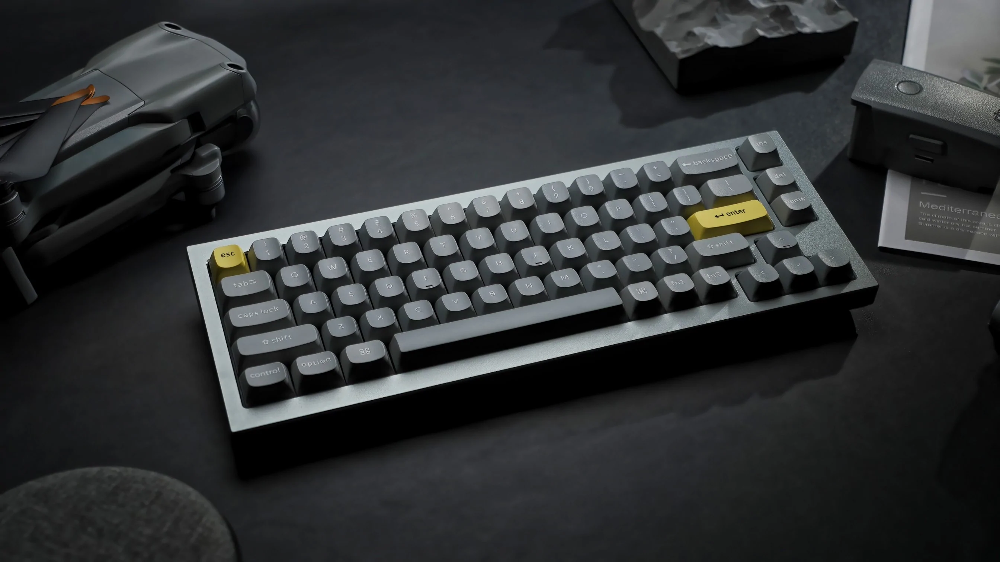

# `Vial for Keychron`
 
This is ***not*** the actual code to the Keychron Q/V boards, but *modified code to used to work with VIAL*.
 
---
 
> :warning: : THIS CODE IS INTENDED FOR EDUCATIONAL PURPOSES ONLY AND DOES NOT REPRESENT KEYCHRON IN ANY WAY.
 
---
 

 
***
 
## Why?
There are those who can't stand VIA for its non-robust set of features that are only down to basic remapping and the such. VIAL is the solution to that which has more features that are similar to what you can do with QMK, but without the hassle of writing the code for it, compiling and flashing the firmware for it to take place. 

Considering that the main QMK repo and VIAL's fork of it has most of the Q and V series in `master/vial`, with more to come, I took the liberty of adding each of these boards via a PR to the `vial-qmk` fork, (I do plan on submitting the rest of PRs to add to the main vial-qmk repo once all of the Q/V boards are merged with `qmk:master`.) Now, I'll show how to get the firmware for these boards so that you can have a taste of what VIAL is like.

This fork will consolidate all of the Q/V boards that are currently out along with all the different variants into one code base.
 
If you don't know what VIAL, VIA, or QMK are, I have tried, to the best of my abililes, explain what the 3 are [here](WHATIS.md). 

# How To
If you're already caught up, please read the [HOW2COMPILE.md](HOW2COMPILE.md) file for instructions on how to use this code.
 
I encourage you to use this code as a basis to learn from, but do note that **this not endorsed by either Keychron, QMK, or VIAL.**
 
-- From Adophoxia
