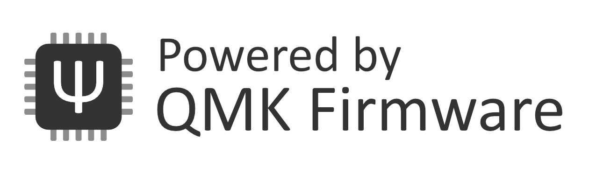

To understand VIAL, we need to understand VIA, but to understand VIA, we need to understand QMK. 
(The following below is an oversimplification, but acts as a means to get a general sense of the terms.)

## What is QMK?

 
QMK is an open source keyboard firmware that you can load onto the keyboard, provided the bootloader is not locked, instead of any proprietary ones that it comes with. This basically acts as the defacto standard for custom keyboards like Keychron’s since instead of having to rely on a vendor/manufacturer to keep up their end of the bargain and provide updates to their keyboards, you can do so yourself since the source code is available to use, along with other additions made by the community. You can program anything that you can to your keyboard, including: 
* Setting up multiple layers (Ex; gaming - only WASD and Arrows are active, RGB - Lighting configuration, numpad - Any 10 keys on your keyboard used as 0-9, MacOS - Set up a keymap with keys to use on MacOS, etc.)
* Rebind keys to what you want (swap FN key to somewhere like Caps lock if you use WASD as arrow keys)
* Macros you can make that react to a key bound to it when pressed
* And so much more...
    * Any changes you make will carry over to other machines as well, so you won't have to install software to be able to use the features you programmed. 

This is all done at a *`firmware level`* however, meaning that you'll have to do some coding in order to be able to keyboard function for you, based on how you want it to be. If you don't like the idea of having to program or feel intimidated by it, that's where VIA comes into play.

## What is VIA?

 
VIA is a [*now*] open source GUI that communicates with QMK, letting you change your keymap on your keyboard without needing to reflash firmware. The changes you make using VIA remain persistent on the keyboard, so even when you unplug and replug your keyboard back in, the keymap settings still remain. 

It's akin to control software from gaming brands like Corsair's iCUE, Razer's Synapse, Logitech's G Hub, etc, meaning you can setup macros, make profiles to be used on other machines when you travel with your keyboard, and control the [RGB] lighting to how you see fit, meaning you don't have to do any coding to make these changes. The differences between those control software is that you don't have to deal with problems and annoyances like:
 * Having multiple software installed that essentially do the same thing, causing clutter.
 * Creating an account to be able to use most features that may be locked away if you don't have one.
 * Programs that end up being resource-hogs (Looking at you taking up **>0.6GB of my RAM**, Razer) or having install sizes that are close to even the fork you'll be cloning.
 * Programs that require you to have them be run in the background for them to function.

## What is VIAL?

VIAL is an open source and decentralized alteranative to VIA, and also a [fork of QMK](https://github.com/vial-kb/vial-qmk) itself. The `decentralized` part refers to the fact that you do not have to submit your keyboard as a pull-request to any third-party repositories (`the-via:keyboards`) before it can be used in the GUI. Instead, the keymap JSON definition (what you load into VIA to recognize a board if it's not in the repo) is stored within the keyboard firmware and is retrieved at runtime, meaning you don't have to load a JSON to make VIAL recognize the board or wait for a pull request to be made to the main QMK repo and/or `the-via:keyboards` repo to add support for the rest of the Q/V boards. If you've ever wondered why you always had to deal with the "Searching for Devices" screen when you open VIA with any Q/V board besides the 2 I mentioned plugged in, this is why. It's also why in these situations, it's instructed that you load the JSON file (the one I talked about earlier) that Keychron provides for whatever board you have. 
 
## Why use Vial then instead of VIA if it's such a pain?
 * Control your RGB lighting in software instead of on the keyboard itself. (As of Sep 9, there's still a bug with VIA where the lighting of the LEDs crashes if you change the brightness, forcing you to change brightness from the keyboard itself.) 
 * Setup Tap-Dance keys that do one function if you tap on them, another if you hold, double tap, or tap and hold, all on one single key.
 * (If your keyboard has a knob) Change what the rotary encoder does besides play/pause and changing volume while adding support for them
 * Enabling QMK settings like One Shot keys, Tap-Hold, and other functions in software instead of creating a new firmware file.
 * And so much more...
